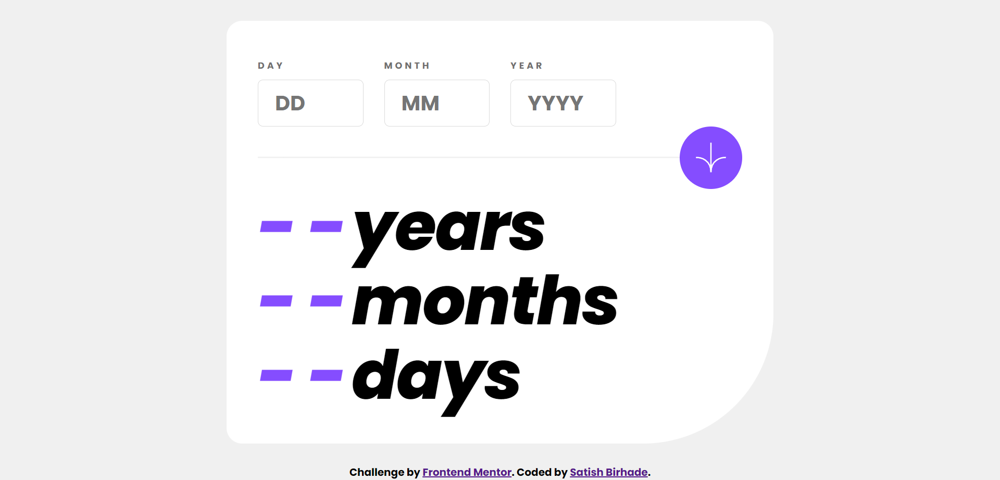
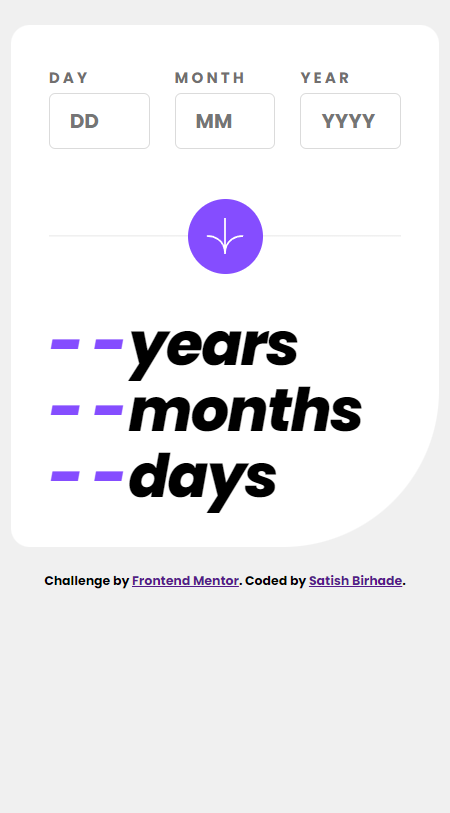

# Frontend Mentor - Age calculator app solution

This is a solution to the [Age calculator app challenge on Frontend Mentor](https://www.frontendmentor.io/challenges/age-calculator-app-dF9DFFpj-Q). Frontend Mentor challenges help you improve your coding skills by building realistic projects. 

## Table of contents

- [Frontend Mentor - Age calculator app solution](#frontend-mentor---age-calculator-app-solution)
  - [Table of contents](#table-of-contents)
  - [Overview](#overview)
    - [The challenge](#the-challenge)
    - [Screenshot](#screenshot)
      - [Desktop View](#desktop-view)
      - [Mobile View](#mobile-view)
    - [Links](#links)
  - [My process](#my-process)
    - [Built with](#built-with)
    - [What I learned](#what-i-learned)
    - [Useful resources](#useful-resources)
  - [Author](#author)

**Note: Delete this note and update the table of contents based on what sections you keep.**

## Overview

### The challenge

Users should be able to:

- View an age in years, months, and days after submitting a valid date through the form
- Receive validation errors if:
  - Any field is empty when the form is submitted
  - The day number is not between 1-31
  - The month number is not between 1-12
  - The year is in the future
  - The date is invalid e.g. 31/04/1991 (there are 30 days in April)
- View the optimal layout for the interface depending on their device's screen size
- See hover and focus states for all interactive elements on the page

### Screenshot

#### Desktop View


#### Mobile View


### Links

- Solution URL: [https://github.com/SatishB15/age-calculator-app](https://github.com/SatishB15/age-calculator-app)
- Live Site URL: [https://age-calculator-app-nine-dun.vercel.app/](https://age-calculator-app-nine-dun.vercel.app/)

## My process

### Built with

- Semantic HTML5 markup
- CSS custom properties
- Flexbox
- CSS Grid
- Mobile-first workflow
- [Javascript](https://developer.mozilla.org/en-US/docs/Web/JavaScript) - Javascript

### What I learned

```html
<h1>Some HTML code I'm proud of</h1>
<h1 class="output">
      <em id="years">- -</em>
      years
      <br />
      <em id="months">- -</em>
      months
      <br />
      <em id="days">- -</em>
      days
    </h1>
```
```css
.proud-of-this-css {
@media (hover: hover) {
  .field__input {
    cursor: pointer;
  }
  .field__input:hover {
    border-color: var(--color-purple);
  }
  .button {
    transition: background-color 0.2s ease-in;
  }
  .button:enabled {
    cursor: pointer;
  }
  .button:enabled:hover {
    background-color: var(--color-black);
  }
  }
}
```
```js
const proudOfThisFunc = (day, month, year) => {
    const birthDate = new Date(year, month - 1, day);

    let years = currentDate.getFullYear() - birthDate.getFullYear();
    let months = currentDate.getMonth() - birthDate.getMonth();
    let days = currentDate.getDate() - birthDate.getDate();

    /// If the birth date month is later than currentDate's date month, adjust the years and months
    if (months < 0 || (months == 0 && days < 0)) {
        years--;
        months += 12;
    }

    // If the birth date day is later than currentDate's date day, adjust the days and months
    if (days < 0) {
        const daysInLastMonth = new Date(
            currentDate.getFullYear(),
            currentDate.getMonth(),
            0
        ).getDate();
        days += daysInLastMonth;
        months--;
    }

    years.textContent = years;
    months.textContent = months;
    days.textContent = days;
    const emElements = document.querySelectorAll('em');
    emElements.forEach(element => {
        element.style.color = 'hsl(0, 100%, 50%)';
    });
};
```

### Useful resources

- [HTML](https://www.w3schools.com/html/) - The resources on HTML provided by W3Schools were instrumental in helping me understand the structure and semantics of web pages. I particularly appreciated the clear explanations and practical examples, which I will continue to use in future projects.
- [CSS](https://www.w3schools.com/css/) - The comprehensive guide on CSS by W3Schools significantly enhanced my understanding of styling and layout. The detailed tutorials and examples made it easier to grasp complex concepts, and I highly recommend it to anyone looking to improve their CSS skills.
- [Javascript](https://www.w3schools.com/javascript/) - W3Schools' JavaScript tutorials were incredibly helpful in demystifying the fundamentals of scripting and dynamic content. The step-by-step approach and practical exercises were invaluable in building my confidence and competence in JavaScript.

## Author

- Frontend Mentor - [@SatishB15](https://www.frontendmentor.io/profile/SatishB15)
- Twitter - [@BirhadeSatish](https://x.com/BirhadeSatish)
- LinkedIn - [Satish Birhade](www.linkedin.com/in/satish-birhade)